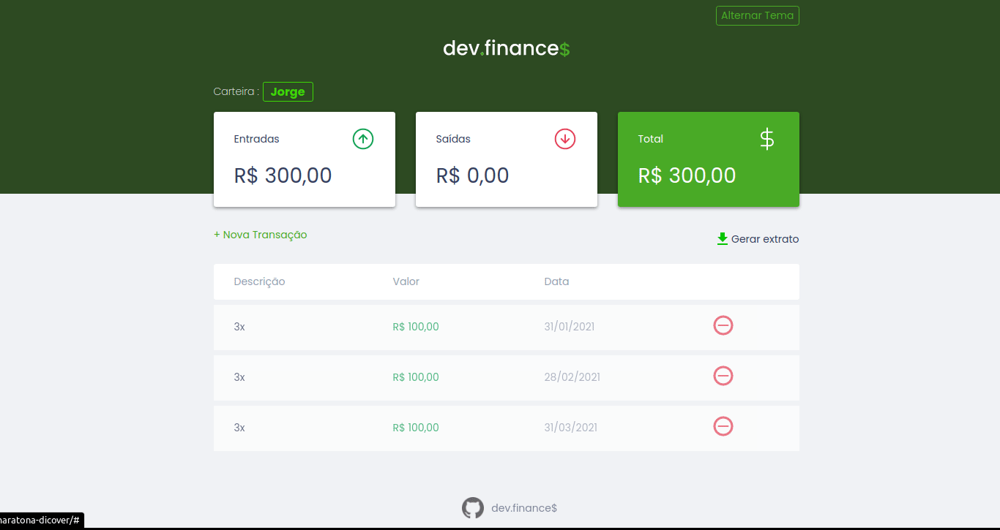
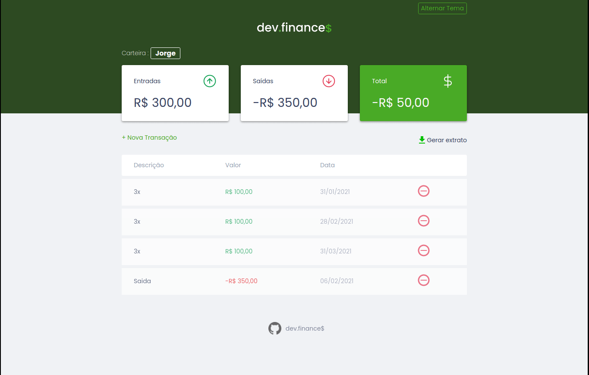
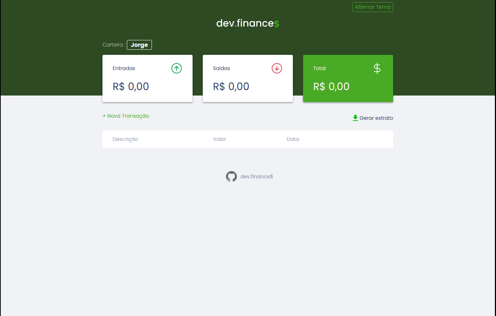

  

    
    

  <h1>&#128125; Maratona Discover - dev.finance$ &#128125;</h1>
  
Durante a <b>Maratona Discover</b> o professor <b>Mayk Brito</b> da <b>Rocket Seat</b>, desenvolveu a aplicação de controle financeiro <b>de.finance$</b>, utilizando os conceitos básicos de HTML, CSS E JavaScript.

  
Como desafio proposto aos participantes que desenvolvessem novas funcionalidades no projeto de forma livre.

  
Neste repositório você vai encontrar o projeto completo, com as novas funcionalidades que desenvolvi e tutorias para implementa-las.

    <h1>&#9881;&#65039; Funcionalidades</h1>

  <h4>
    <a href="#dark-mode"> Dark Mode </a> | 
    <a href="#extract"> Extrato </a> | 
    <a href="#plots"> Parcelas </a> | 
    <a href="#wallets"> Carteiras </a>
  </h4>
  
Aqui você vai encontrar todas as funcionalidades que foram desenvolvidas e os links para acessar os tutoriais para implementa-las em seu projeto.

  <h2><a href="#Funcionalidades">&#11013;</a> Dark Mode</h2>
  

  
Neste tutorial você vai poder implementar o dark mode em seu projeto, foram utilizados os conhecimento passados durante a maratona e o mínimo de conhecimento externo para a implementação

  
Para os conhecimentos que não foram apresentados na maratona foram deixados links para conteúdos complementares.

  <a href="./docs/dark_mode_tutorial.md">Ver Tutorial</a>

  <h2><a href="#Funcionalidades">&#11013;</a> Extrato</h2>
  

  
Aqui foi implementada uma funcionalidade para gerar e baixar o extrato das transações, assim você pode ter um registro off line de suas finanças. Neste tutorial foram usados conhecimentos apresentados na maratona e alguns outro que não foram vistos.

  
Para os conhecimentos que não foram apresentados na maratona deixado links para conteúdos complementares.

  <a href="./docs/extract.md">Ver Tutorial</a>

  <h2><a href="#Funcionalidades">&#11013;</a> Parcelas</h2>
  

  
Este tutorial mostra como implementar o funcionalidade de criar múltiplas parcelas/transações, cada parcela tem um mês de diferença da outro. Para adicionar essa funcionalidade foram usados os conhecimento passados durante a maratona.

  
Para os conhecimento que não foram apresentados na maratona foram deixados links para conteúdos complementares.

  <a href="./docs/plots.md">Ver Tutorial</a>

  <h2><a href="#Funcionalidades">&#11013;</a> Carteiras</h2>
  

  
Neste tutorial vou mostrar como criar múltiplas carteira/contas, para você poder ter mais de um usuário usando o mesmo navegador. A base de conhecimento utilizada foi apresentada durante a maratona e poucos conhecimentos externos foram utilizados.

  
Para os conhecimento que não foram apresentados na maratona foram deixados links para conteúdos complementares.

  <a href="./docs/wallets_tutorial.md">Ver Tutorial</a>

