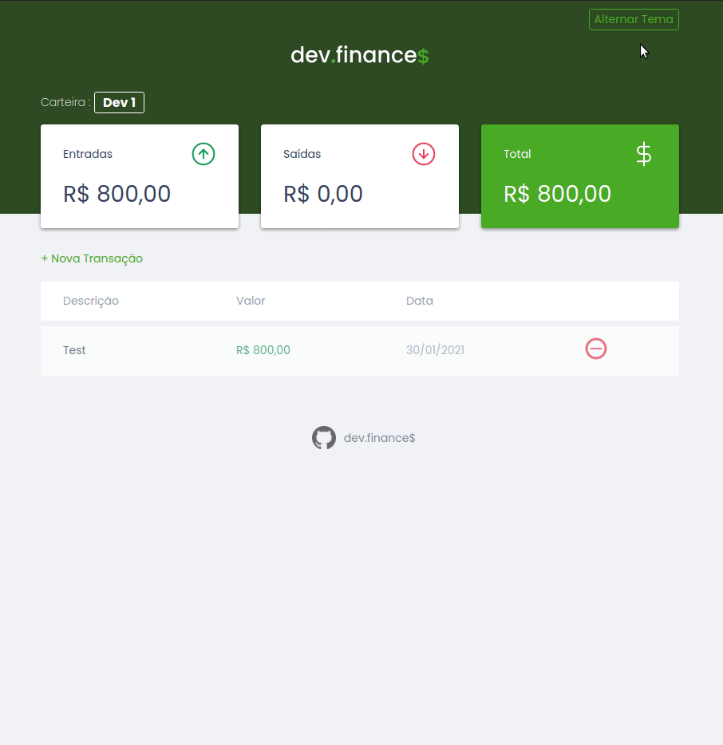
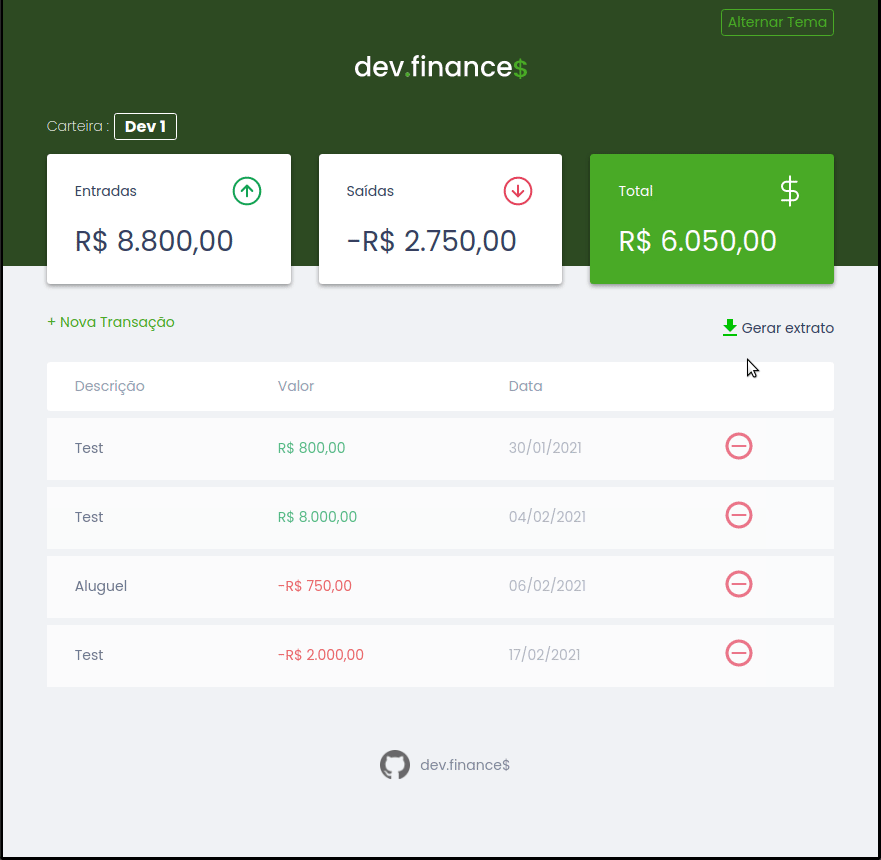
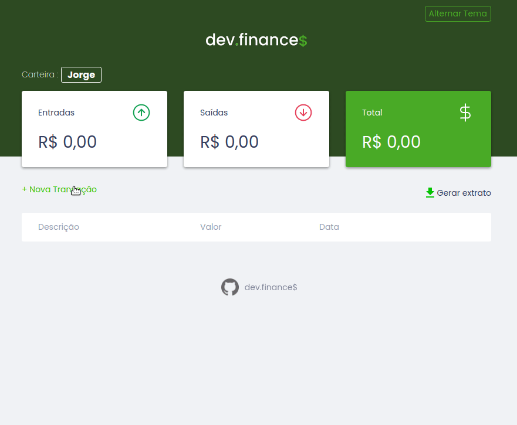
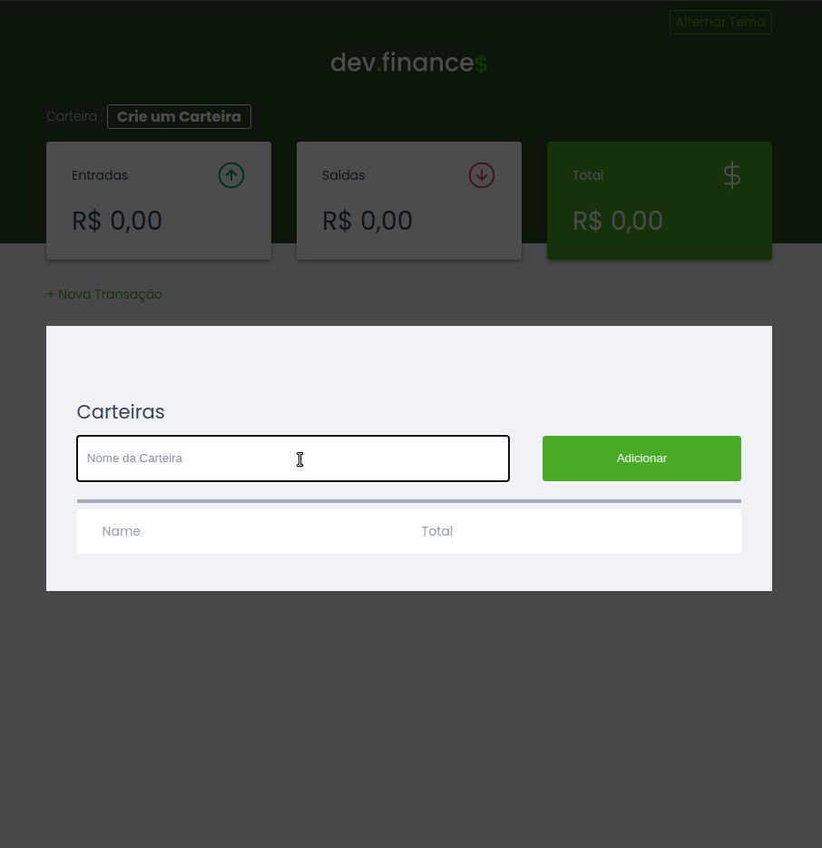

# Dev.Finance$

Projeto para administração financeira pessoal, desenvolvido durante a **Maratona Discover** pelo **Mayk Brito** da **Rocket Seat**.

## Objetivo

Alem de reforçar meus conhecimentos de front-end, utilizei o projeto para criar novas funcionalidades e fazer tutoriais de como implementa-las.
Me esforcei para manter essas funcionalidades dentro do conhecimentos passados durante as **Maratona Discover**.

As funcionalidades implementadas foram:

  
  <table id="wallets-table">
    <thead>
      <tr>
        <th>Funcionalidade</th>
        <th>Descrição</th>
      </tr>
    </thead>
    <tbody>
      <tr>
        <td>
          
        </td>
        <td>
        <h4>Dark Mode</h4>
        
Implementação do modo escuro.

        Com mudança automática que se adequa 
        ao sistema e botão para alternar modo 
        

          <a href="./docs/dark_mode_tutorial.md">Ver Tutorial</a>
        

        </td>
      </tr>
      <tr>
        <td>
          
        </td>
        <td>
        <h4>Extrato</h4>
        
Implementação da funcionalidade para gerar um extrato.

        Com essa funcionalidade você pode manter 
        o registro de suas transações em um arquivo externo  
        

          <a href="./docs/extract.md">Ver Tutorial</a>
        

        </td>
      </tr>
      <tr>
        <td>
          
        </td>
        <td>
        <h4>Parcelas</h4>
        
Implementação de múltiplas transações.

        Você poderá cadastrar múltiplas transações 
        de uma vez, pulando de mês em mês. 
        

          <a href="./docs/dark_mode_tutorial.md">Ver Tutorial</a>
        

        </td>
      </tr>
      <tr>
        <td>
          
        </td>
        <td>
        <h4>Múltiplas Carteira</h4>
        
Implementação para varias carteiras.

        Permite que você tenha carteira separadas 
        assim mais de um usuário pode usar a aplicação 
        

          <a href="./docs/wallets_tutorial.md">Ver Tutorial</a>
        

        </td>
      </tr>
    </tbody>
  </table>

